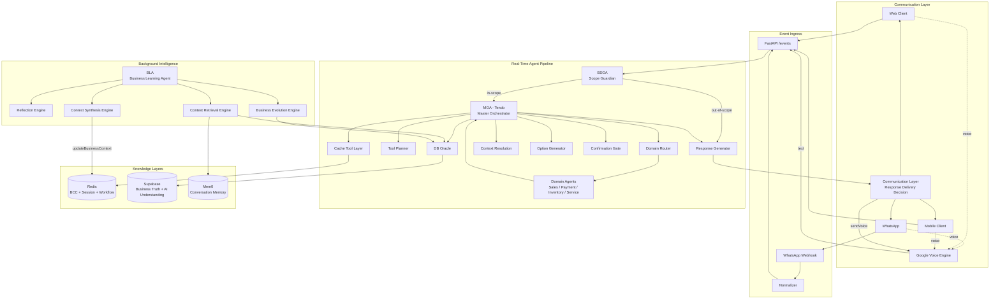
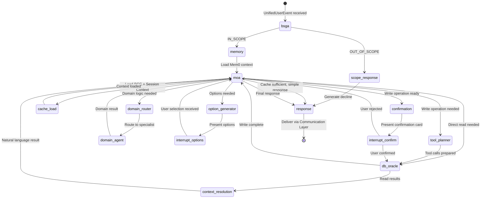
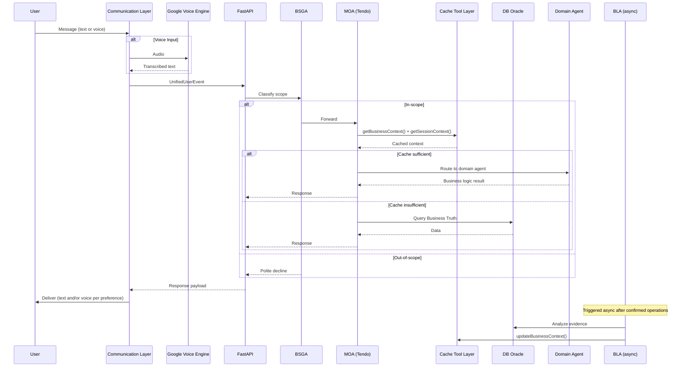

# Design Document: MO-COS v2 — Adaptive Business Intelligence Operating System

## Overview

MO-COS v2 (Master-Orchestrated Conversational Option System) is a multi-agent AI system that learns how a business operates and manages operations through natural conversations. The architecture separates real-time execution from asynchronous intelligence, using a cache-first strategy where the AI agent ("Tendo") works from prepared business knowledge rather than querying databases on every interaction.

The system is built on:
- **Python 3.11+** with FastAPI for the API layer
- **LangGraph** for deterministic, checkpointed agent orchestration
- **Anthropic Claude** as the LLM backbone
- **Redis** for workflow state, session context, and Business Context Cache (BCC)
- **Supabase (PostgreSQL)** for Business Truth and AI Business Understanding
- **Mem0** for conversation memory and communication preferences
- **Google Voice Engine** for centralized STT/TTS processing

The core processing flow splits into two paths:
1. **Real-time path**: User → Communication Layer → BSGA → MOA → Cache Tool Layer (BCC) → Domain Agents → DB Oracle → Response
2. **Background intelligence path**: Business Event → BLA → Reflection → AI Business Understanding → BCC Refresh

## Architecture

### System Architecture Diagram



### LangGraph State Machine



### Request-Response Sequence



## Components and Interfaces

### 1. Event Ingress Layer (`app/main.py`)

**Responsibilities**: HTTP endpoint routing, request validation, event dispatch.

| Endpoint | Method | Purpose |
|----------|--------|---------|
| `/events` | POST | Accept UnifiedUserEvent from all channels |
| `/webhook/whatsapp` | GET | Meta webhook verification |
| `/webhook/whatsapp` | POST | Receive WhatsApp messages |
| `/health` | GET | Liveness check |

**Interface**:
```python
# app/models/event.py
class UnifiedUserEvent(BaseModel):
    event_id: str = Field(max_length=128, min_length=1)
    thread_id: str = Field(max_length=128, min_length=1)
    user_id: str = Field(max_length=128, min_length=1)
    text: str = Field(max_length=4096, min_length=1)
    channel: Literal["web", "mobile", "whatsapp"]
    input_type: Literal["text", "voice"]
    selected_option_id: str | None = None
    metadata: dict | None = None
```

### 2. Communication Layer (`app/communication/`)

**Responsibilities**: Channel abstraction, voice processing coordination, response delivery decisions.

| Module | Role |
|--------|------|
| `layer.py` | Response Delivery Decision engine |
| `voice.py` | Google Voice Engine STT/TTS integration |
| `delivery.py` | sendText() and sendVoice() tool implementations |

**Delivery Decision Matrix**:

| Channel | User Preference | Delivery Action |
|---------|----------------|-----------------|
| App | Voice+Text (default) | sendText + sendVoice |
| App | Text Only | sendText |
| App | Voice Only | sendVoice |
| WhatsApp | Text input | sendText |
| WhatsApp | Voice input | sendVoice |

**Interface**:
```python
# app/communication/delivery.py
async def send_text(text: str, channel: str, user_id: str, thread_id: str) -> DeliveryResult: ...
async def send_voice(text: str, channel: str, user_id: str, thread_id: str) -> DeliveryResult: ...

# app/communication/voice.py
async def transcribe(audio_bytes: bytes, timeout: float = 10.0) -> str: ...
async def synthesize(text: str, timeout: float = 10.0) -> bytes: ...
```

### 3. BSGA (`app/agents/bsga.py`, `app/graph/nodes/bsga.py`)

**Responsibilities**: Classify every request as IN_SCOPE or OUT_OF_SCOPE. Zero access to business data.

**Input**: User text + platform scope definition (from spec files)
**Output**: `{"classification": "IN_SCOPE" | "OUT_OF_SCOPE", "decline_message": str | None}`

**Constraints**:
- No imports from `app.db`, `app.memory`, `app.redis`
- Must respond within 3 seconds
- Ambiguous requests default to OUT_OF_SCOPE

### 4. MOA — "Tendo" (`app/agents/moa.py`, `app/graph/nodes/moa.py`)

**Responsibilities**: Central routing, context sufficiency decisions, workflow orchestration.

**Key decisions MOA makes on each turn**:
1. Is cache context sufficient for this request?
2. Which domain agent (if any) should handle the business logic?
3. Does this require a write operation (→ confirmation gate)?
4. What output mode — CONVERSATION or STRUCTURED_OPTIONS?

**Constraints**:
- No database client imports
- Reads from BCC via Cache Tool Layer only
- Never produces audio — always canonical text

### 5. Cache Tool Layer (`app/redis/`)

**Interface**:
```python
# Exposed as LangGraph tools
async def get_business_context(business_id: str) -> BusinessContext: ...
async def get_session_context(business_id: str, thread_id: str) -> SessionContext: ...
async def update_business_context(business_id: str, context: BusinessContext) -> None: ...
async def update_session_context(business_id: str, thread_id: str, context: SessionContext) -> None: ...
```

**Redis Key Schema**:
```
bcc:{business_id}:profile          → Business Profile JSON (TTL: 24h)
bcc:{business_id}:understanding    → Business Understanding Summary (TTL: 24h)
bcc:{business_id}:entities         → Frequently Used Entities (TTL: 24h)
bcc:{business_id}:awareness        → Operational Awareness (TTL: 24h)
bcc:{business_id}:recent           → Recent Business Summary (TTL: 24h)
session:{business_id}:{thread_id}:context → Session Context (TTL: 24h)
```

**Performance**: All operations must return within 100ms.

### 6. DB Oracle (`app/db/`)

**Responsibilities**: Sole Supabase access point. Executes confirmed tool requests only.

**Read Tools**: `search_customers`, `search_products`, `search_services`, `search_payments`, `search_invoices`, `search_inventory`, `get_customer_history`, `get_business_context`

**Write Tools**: `create_sale`, `create_payment`, `create_invoice`, `update_inventory`, `create_service_record`, `record_refund`, `record_debt`

**AI Understanding Tools**: `get_business_understanding`, `add_evidence`, `update_confidence`, `evolve_understanding`, `get_evolution_history`

**Session Tools**: `create_session`, `get_session_history`, `store_message`, `get_session_messages`

**Checkpoint Tools**: `create_checkpoint`, `get_checkpoints`

**Guards**:
- All write ops require `confirmation_status == "confirmed"`
- Idempotency via event_id deduplication
- RLS filtering by business_id on every query
- Audit log entry on every write (success or failure)

### 7. Domain Agents (`app/agents/domain/`)

| Agent | Scope |
|-------|-------|
| `sales.py` | Sales recording, sales analysis, credit/cash logic |
| `payment.py` | Payment recording, debt tracking, refunds |
| `inventory.py` | Stock updates, movement tracking, low-stock alerts |
| `service.py` | Service records, service delivery tracking |

**Constraints**: No imports from `app.db`, `app.memory`, `app.redis`. Request data exclusively through MOA routing.

### 8. BLA (`app/agents/bla.py`)

**Responsibilities**: Asynchronous intelligence — never in the request path.

**Trigger conditions**:
- After confirmed business operations (event-driven)
- Daily midnight reflection job (scheduled)

**Internal engines**:
1. **Context Retrieval Engine** → Collects Business Truth + Conversation History + existing AI Understanding + Mem0
2. **Reflection Engine** → Analyzes evidence after confirmed operations
3. **Business Evolution Engine** → Manages hypothesis confidence lifecycle
4. **Context Synthesis Engine** → Produces BCC payload → writes to Redis

**Evidence Trust Order**: Business Truth > Confirmed Conversation History > AI Business Understanding > Mem0

### 9. Memory Node (`app/memory/`)

**Responsibilities**: Exclusive Mem0 access. Retrieval and persistence of communication preferences.

**Constraints**: No Supabase imports. Used by BLA in background path only.

### 10. Agent Spec System (`app/llm/specs.py`)

**Spec loading pipeline**:
```
app/agents/specs/{agent_name}/
    ├── role.md        → Identity and tone
    ├── backstory.md   → System context
    ├── goal.md        → Primary objective
    ├── skill.md       → Capabilities and constraints
    └── tools.md       → Available tools (conditional)
```

**Assembly order**: Role → Backstory → Goal → Skill → Tools

**Interface**:
```python
@dataclass
class AgentConfig:
    system_prompt: str
    agent_name: str
    has_tools: bool

def load(agent_name: str) -> AgentConfig: ...
```

**Modes**:
- Development (`SPEC_HOT_RELOAD=true`): Re-reads .md on every call
- Production: Cached, reload on restart or explicit invalidation

### 11. Output Model (`app/output/`)

```python
# app/models/output.py
class ConversationOutput(BaseModel):
    mode: Literal["conversation"] = "conversation"
    text: str = Field(max_length=2000)

class OptionsOutput(BaseModel):
    mode: Literal["structured_options"] = "structured_options"
    option_type: Literal["question", "confirmation", "classification", "missing_info"]
    prompt: str
    options: list[Option]  # 2-10 items
    allows_freeform: bool = True

class Option(BaseModel):
    id: str
    label: str
    description: str | None = None
    is_recommended: bool = False
```

### 12. LangGraph Workflow (`app/graph/workflow.py`)

**GraphState definition**:
```python
# app/models/state.py
class GraphState(TypedDict):
    event: UnifiedUserEvent
    classification: str | None           # IN_SCOPE / OUT_OF_SCOPE
    business_context: dict | None        # From BCC
    session_context: dict | None         # From session cache
    intent: str | None                   # Parsed user intent
    tool_requests: list[dict] | None     # From Tool Planner
    domain_result: dict | None           # From Domain Agent
    db_result: dict | None               # From DB Oracle
    confirmation_status: str | None      # pending / confirmed / rejected
    output_mode: str | None              # conversation / structured_options
    response: dict | None                # Final response payload
    messages: list[dict]                 # Conversation messages
    error: str | None
```

**Nodes**: `bsga`, `memory`, `moa`, `tool_planner`, `db_oracle`, `context_resolution`, `option_generator`, `domain_router`, `confirmation`, `response`

**Interrupts**: `interrupt_before` on `confirmation` and `option_generator` nodes (timeout: 300s)

**Checkpointing**: Redis checkpointer, keyed by `thread_id`, TTL 24 hours.

## Data Models

### Supabase Schema (Core Tables)

```sql
-- Users and tenancy
CREATE TABLE users (
    id UUID PRIMARY KEY DEFAULT gen_random_uuid(),
    business_id UUID NOT NULL,
    email TEXT UNIQUE NOT NULL,
    name TEXT,
    communication_preference TEXT DEFAULT 'voice_text', -- voice_text / text_only / voice_only
    created_at TIMESTAMPTZ DEFAULT now()
);

-- Customers
CREATE TABLE customers (
    id UUID PRIMARY KEY DEFAULT gen_random_uuid(),
    business_id UUID NOT NULL REFERENCES users(business_id),
    name TEXT NOT NULL,
    phone TEXT,
    email TEXT,
    type TEXT DEFAULT 'customer', -- customer / supplier / both
    balance NUMERIC(12,2) DEFAULT 0,
    metadata JSONB DEFAULT '{}',
    created_at TIMESTAMPTZ DEFAULT now(),
    updated_at TIMESTAMPTZ DEFAULT now()
);

-- Products
CREATE TABLE products (
    id UUID PRIMARY KEY DEFAULT gen_random_uuid(),
    business_id UUID NOT NULL REFERENCES users(business_id),
    name TEXT NOT NULL,
    unit TEXT,
    unit_price NUMERIC(12,2),
    category TEXT,
    metadata JSONB DEFAULT '{}',
    created_at TIMESTAMPTZ DEFAULT now()
);

-- Services
CREATE TABLE services (
    id UUID PRIMARY KEY DEFAULT gen_random_uuid(),
    business_id UUID NOT NULL REFERENCES users(business_id),
    name TEXT NOT NULL,
    price NUMERIC(12,2),
    category TEXT,
    metadata JSONB DEFAULT '{}',
    created_at TIMESTAMPTZ DEFAULT now()
);

-- Inventory
CREATE TABLE inventory (
    id UUID PRIMARY KEY DEFAULT gen_random_uuid(),
    business_id UUID NOT NULL REFERENCES users(business_id),
    product_id UUID REFERENCES products(id),
    quantity NUMERIC(12,2) DEFAULT 0,
    reorder_level NUMERIC(12,2),
    last_updated TIMESTAMPTZ DEFAULT now()
);

-- Inventory Movements
CREATE TABLE inventory_movements (
    id UUID PRIMARY KEY DEFAULT gen_random_uuid(),
    business_id UUID NOT NULL REFERENCES users(business_id),
    inventory_id UUID NOT NULL REFERENCES inventory(id),
    movement_type TEXT NOT NULL, -- in / out / adjustment
    quantity NUMERIC(12,2) NOT NULL,
    reference TEXT,
    created_at TIMESTAMPTZ DEFAULT now()
);

-- Transactions (sales, purchases)
CREATE TABLE transactions (
    id UUID PRIMARY KEY DEFAULT gen_random_uuid(),
    business_id UUID NOT NULL REFERENCES users(business_id),
    customer_id UUID REFERENCES customers(id),
    type TEXT NOT NULL, -- sale / purchase / refund
    payment_type TEXT, -- cash / credit / transfer
    total NUMERIC(12,2) NOT NULL,
    status TEXT DEFAULT 'completed',
    metadata JSONB DEFAULT '{}',
    created_at TIMESTAMPTZ DEFAULT now()
);

-- Invoices
CREATE TABLE invoices (
    id UUID PRIMARY KEY DEFAULT gen_random_uuid(),
    business_id UUID NOT NULL REFERENCES users(business_id),
    customer_id UUID NOT NULL REFERENCES customers(id),
    invoice_number TEXT,
    total NUMERIC(12,2) NOT NULL,
    status TEXT DEFAULT 'pending', -- pending / paid / overdue / cancelled
    due_date DATE,
    created_at TIMESTAMPTZ DEFAULT now()
);

-- Invoice Line Items
CREATE TABLE invoice_line_items (
    id UUID PRIMARY KEY DEFAULT gen_random_uuid(),
    business_id UUID NOT NULL REFERENCES users(business_id),
    invoice_id UUID NOT NULL REFERENCES invoices(id),
    description TEXT NOT NULL,
    quantity NUMERIC(12,2) NOT NULL,
    unit_price NUMERIC(12,2) NOT NULL,
    total NUMERIC(12,2) NOT NULL
);

-- Payments
CREATE TABLE payments (
    id UUID PRIMARY KEY DEFAULT gen_random_uuid(),
    business_id UUID NOT NULL REFERENCES users(business_id),
    invoice_id UUID REFERENCES invoices(id),
    customer_id UUID REFERENCES customers(id),
    amount NUMERIC(12,2) NOT NULL,
    payment_method TEXT,
    reference TEXT,
    created_at TIMESTAMPTZ DEFAULT now()
);

-- Ledger Entries
CREATE TABLE ledger_entries (
    id UUID PRIMARY KEY DEFAULT gen_random_uuid(),
    business_id UUID NOT NULL REFERENCES users(business_id),
    transaction_id UUID NOT NULL REFERENCES transactions(id),
    entry_type TEXT NOT NULL, -- debit / credit
    amount NUMERIC(12,2) NOT NULL,
    account TEXT NOT NULL,
    created_at TIMESTAMPTZ DEFAULT now()
);

-- AI Business Understanding
CREATE TABLE ai_business_understanding (
    id UUID PRIMARY KEY DEFAULT gen_random_uuid(),
    business_id UUID NOT NULL REFERENCES users(business_id),
    summary TEXT NOT NULL,
    confidence FLOAT NOT NULL DEFAULT 0.5 CHECK (confidence >= 0.0 AND confidence <= 1.0),
    evidence_count INTEGER DEFAULT 0,
    evidence_references JSONB DEFAULT '[]',
    correction_history JSONB DEFAULT '[]',
    evolution_history JSONB DEFAULT '[]',
    status TEXT DEFAULT 'active' CHECK (status IN ('active', 'retired')),
    created_at TIMESTAMPTZ DEFAULT now(),
    updated_at TIMESTAMPTZ DEFAULT now()
);

-- Business Evidence
CREATE TABLE business_evidence (
    id UUID PRIMARY KEY DEFAULT gen_random_uuid(),
    business_id UUID NOT NULL REFERENCES users(business_id),
    understanding_id UUID NOT NULL REFERENCES ai_business_understanding(id),
    evidence_type TEXT NOT NULL CHECK (evidence_type IN ('confirmation', 'correction', 'observation')),
    source_reference JSONB NOT NULL,
    description TEXT NOT NULL,
    created_at TIMESTAMPTZ DEFAULT now()
);

-- Conversation Sessions
CREATE TABLE conversation_sessions (
    id UUID PRIMARY KEY DEFAULT gen_random_uuid(),
    business_id UUID NOT NULL REFERENCES users(business_id),
    user_id UUID NOT NULL REFERENCES users(id),
    title TEXT NOT NULL,
    status TEXT DEFAULT 'active' CHECK (status IN ('active', 'archived')),
    created_at TIMESTAMPTZ DEFAULT now(),
    updated_at TIMESTAMPTZ DEFAULT now()
);

-- Conversation Messages
CREATE TABLE conversation_messages (
    id UUID PRIMARY KEY DEFAULT gen_random_uuid(),
    business_id UUID NOT NULL REFERENCES users(business_id),
    session_id UUID NOT NULL REFERENCES conversation_sessions(id),
    role TEXT NOT NULL CHECK (role IN ('user', 'assistant')),
    content TEXT NOT NULL,
    message_type TEXT NOT NULL DEFAULT 'text', -- text/voice/understanding_card/question_card/confirmation_card/operation_card
    metadata JSONB DEFAULT '{}',
    created_at TIMESTAMPTZ DEFAULT now()
);

-- Operation Checkpoints
CREATE TABLE operation_checkpoints (
    id UUID PRIMARY KEY DEFAULT gen_random_uuid(),
    business_id UUID NOT NULL REFERENCES users(business_id),
    session_id UUID NOT NULL REFERENCES conversation_sessions(id),
    message_id UUID REFERENCES conversation_messages(id),
    operation_type TEXT NOT NULL,
    user_input TEXT NOT NULL,
    ai_understanding_summary TEXT,
    before_state JSONB NOT NULL,
    after_state JSONB NOT NULL,
    status TEXT DEFAULT 'confirmed' CHECK (status IN ('confirmed', 'reverted')),
    created_at TIMESTAMPTZ DEFAULT now()
);

-- Conversation State (LangGraph persistence metadata)
CREATE TABLE conversation_state (
    id UUID PRIMARY KEY DEFAULT gen_random_uuid(),
    business_id UUID NOT NULL REFERENCES users(business_id),
    thread_id TEXT NOT NULL,
    state_data JSONB,
    created_at TIMESTAMPTZ DEFAULT now(),
    updated_at TIMESTAMPTZ DEFAULT now()
);

-- Audit Logs
CREATE TABLE audit_logs (
    id UUID PRIMARY KEY DEFAULT gen_random_uuid(),
    business_id UUID NOT NULL REFERENCES users(business_id),
    user_id UUID NOT NULL REFERENCES users(id),
    operation_type TEXT NOT NULL,
    affected_entity JSONB NOT NULL, -- {table: str, id: str}
    status TEXT DEFAULT 'success', -- success / failed
    failure_reason TEXT,
    event_id TEXT UNIQUE, -- Idempotency key
    created_at TIMESTAMPTZ DEFAULT now()
);

-- Suppliers (aliased from customers with type='supplier')
-- Note: suppliers share the customers table with type='supplier' or type='both'

-- Enable pgvector
CREATE EXTENSION IF NOT EXISTS vector;
```

### RLS Policy Pattern (Applied to ALL tables)

```sql
-- Example for customers table (same pattern for all)
ALTER TABLE customers ENABLE ROW LEVEL SECURITY;

CREATE POLICY "tenant_isolation" ON customers
    FOR ALL
    USING (business_id = (auth.jwt() ->> 'business_id')::uuid)
    WITH CHECK (business_id = (auth.jwt() ->> 'business_id')::uuid);
```

### Redis Data Structures

**Business Context Cache (BCC)**:
```json
// Key: bcc:{business_id}:profile (TTL: 86400s)
{
    "business_name": "Mama Grace Store",
    "category": "hybrid",
    "description": "Retail shop selling rice, beans, and provisions with delivery service"
}

// Key: bcc:{business_id}:understanding (TTL: 86400s)
{
    "common_behaviors": ["Credit sales are common", "Weekly inventory restock on Mondays"],
    "workflows": ["Sales recorded immediately after delivery"],
    "payment_habits": ["Most customers pay at month end"],
    "terminology": {"bags": "50kg bags of rice", "cartons": "cases of provisions"},
    "communication_style": "Informal, direct, uses product nicknames"
}

// Key: bcc:{business_id}:entities (TTL: 86400s)
{
    "customers": [{"id": "...", "name": "Musa", "frequency": 45}],
    "products": [{"id": "...", "name": "Rice (50kg)", "frequency": 120}],
    "services": [],
    "suppliers": [{"id": "...", "name": "Dangote Distributor", "frequency": 12}]
}

// Key: bcc:{business_id}:awareness (TTL: 86400s)
{
    "alerts": ["Low stock: Rice (15 bags remaining)"],
    "outstanding_debts": [{"customer": "Musa", "amount": 45000}],
    "inventory_warnings": ["Beans below reorder level"]
}

// Key: bcc:{business_id}:recent (TTL: 86400s)
{
    "recent_activities": ["3 sales today totaling ₦125,000"],
    "current_focus": "End-of-month debt collection",
    "patterns": ["Sales volume increasing on weekends"]
}
```

**Session Context Cache**:
```json
// Key: session:{business_id}:{thread_id}:context (TTL: 86400s)
{
    "current_topic": "recording a sale",
    "current_customer": {"id": "...", "name": "Musa"},
    "current_product": {"id": "...", "name": "Rice (50kg)"},
    "pending_confirmation": null,
    "workflow_stage": "awaiting_quantity",
    "temporary_decisions": []
}
```

### Workflow State (Redis — managed by LangGraph)

```
checkpoint:{thread_id}             → LangGraph state checkpoint (TTL: 86400s)
candidates:{thread_id}             → Pending option choices (TTL: 3600s)
confirmation:{thread_id}           → Pending confirmation details (TTL: 3600s)
```


## Correctness Properties

*A property is a characteristic or behavior that should hold true across all valid executions of a system — essentially, a formal statement about what the system should do. Properties serve as the bridge between human-readable specifications and machine-verifiable correctness guarantees.*

### Property 1: UnifiedUserEvent validation correctness

*For any* input payload submitted to POST /events, if all required fields (event_id, thread_id, user_id, text) are present and contain at least one non-whitespace character with valid channel and input_type enums, the system SHALL return HTTP 200 with the event_id; otherwise, it SHALL return HTTP 422 identifying the failing fields.

**Validates: Requirements 1.1, 1.2, 1.3**

### Property 2: WhatsApp payload transformation

*For any* valid WhatsApp message payload received at POST /webhook/whatsapp, the system SHALL produce a valid UnifiedUserEvent with correct field mapping (sender → user_id, message body → text, channel = "whatsapp") that passes the same validation as direct /events submissions.

**Validates: Requirements 1.5**

### Property 3: Communication event text integrity

*For any* text input from any channel (web, mobile, whatsapp), the text field in the resulting UnifiedUserEvent SHALL be identical to the original input text, and the event SHALL contain all required fields (user_id, business_id, session_id, channel, input_type, text, timestamp).

**Validates: Requirements 2.10, 2.12**

### Property 4: Channel-independent intelligence

*For any* valid business request text, the MOA SHALL produce semantically identical business logic results regardless of whether the request originates from web, mobile, or whatsapp channels — the MOA receives only normalized text with no channel-specific metadata influencing business decisions.

**Validates: Requirements 2.6, 2.13**

### Property 5: Response Delivery Decision correctness

*For any* combination of (channel, user_preference, input_type), the Response Delivery Decision SHALL produce exactly the correct set of delivery tool invocations: App+Voice+Text → sendText+sendVoice; App+TextOnly → sendText; App+VoiceOnly → sendVoice; WhatsApp+text_input → sendText; WhatsApp+voice_input → sendVoice.

**Validates: Requirements 2.15, 2.16, 2.17, 2.18, 2.19, 2.20, 2.21, 14.8, 14.9, 14.10, 14.11, 14.12, 14.13**

### Property 6: Session continuity across channels

*For any* sequence of messages from different channels sharing the same thread_id and user_id, the system SHALL preserve all prior messages, conversation context, and user preferences — session state is invariant to channel switches.

**Validates: Requirements 2.25, 2.26, 2.27**

### Property 7: OUT_OF_SCOPE handling completeness

*For any* request classified as OUT_OF_SCOPE by the BSGA, the system SHALL: (a) return a decline message that acknowledges the input, states MO-COS purpose, and lists business operation examples without answering the request, AND (b) trigger NO downstream processing — no MOA invocation, no BLA trigger, no Mem0 persistence, no DB Oracle access.

**Validates: Requirements 3.15, 3.16, 3.17, 3.18, 3.20, 3.21**

### Property 8: Business Context Cache structure invariant

*For any* business with an active BCC, the cached data SHALL contain exactly the required sections (profile, understanding summary, entities, awareness, recent summary), SHALL NOT contain raw database records (all customers, all products, all sales), and each section SHALL conform to its defined schema.

**Validates: Requirements 4.1, 4.2, 4.3, 4.4, 4.5, 4.6, 4.7, 4.8, 4.9, 4.10**

### Property 9: Cache Tool Layer tenant isolation

*For any* cache tool operation, Redis keys SHALL use the format bcc:{business_id}:* for business context and session:{business_id}:{thread_id}:* for session context, ensuring a request with business_id A can never read or write cache data belonging to business_id B.

**Validates: Requirements 4.26, 4.11**

### Property 10: MOA context sufficiency decision

*For any* request paired with cached business context, when the request involves routine operations with entities present in the cache (known customers, known products, standard workflows), the MOA SHALL proceed without DB Oracle; when the request requires exact current values, historical records, or involves ambiguity, the MOA SHALL delegate to DB Oracle.

**Validates: Requirements 4.17, 4.18, 4.19, 4.20**

### Property 11: AI Business Understanding structure

*For any* AI Business Understanding entry created or updated by the BLA, it SHALL contain: summary (non-empty text), confidence (float 0.0-1.0), evidence_count (non-negative integer), evidence_references (array), correction_history (array), evolution_history (array), creation date, last updated date, and status (active or retired).

**Validates: Requirements 5.9**

### Property 12: Reflection produces evidence observations

*For any* confirmed business operation (sale, payment, inventory update, service record), the BLA Reflection Engine SHALL produce at least one evidence observation that references the original user intent, the executed action, and the operation context.

**Validates: Requirements 5.19, 5.20, 5.21**

### Property 13: Business Evolution Engine confidence lifecycle

*For any* AI Business Understanding entry: supporting evidence SHALL increase confidence (never above 1.0), user corrections SHALL decrease confidence, confidence below 0.2 SHALL trigger retirement, and all confidence changes SHALL be recorded in evolution_history with timestamps.

**Validates: Requirements 5.22, 5.23, 5.24, 5.25, 5.26, 5.27**

### Property 14: Evidence trust order resolution

*For any* conflict between data sources during BLA processing, resolution SHALL follow the strict priority: Business Truth (highest) > Confirmed Conversation History > AI Business Understanding > Mem0 (lowest) — a lower-priority source SHALL never override a higher-priority source.

**Validates: Requirements 5.37**

### Property 15: BLA failure preserves existing data

*For any* BLA processing failure (event-driven or midnight reflection), all previously persisted AI Business Understanding entries and BCC data SHALL remain unchanged — no corruption, no partial updates, no data loss.

**Validates: Requirements 5.36**

### Property 16: Confirmation gate enforcement

*For any* write operation (INSERT, UPDATE, DELETE), if confirmation_status is not "confirmed", the DB Oracle SHALL reject the operation and no database mutation SHALL occur. Only explicit user confirmation transitions the operation to execution.

**Validates: Requirements 8.3, 8.4, 11.1, 11.2, 11.3, 11.4, 11.5, 11.6**

### Property 17: Idempotency enforcement

*For any* write operation with a given event_id, the first invocation SHALL execute and persist the event_id; any subsequent invocation with the same event_id SHALL be rejected with a "previously completed" indication without re-executing the write — the database state after N invocations is identical to after 1 invocation.

**Validates: Requirements 8.5, 12.3**

### Property 18: Audit log creation invariant

*For any* write operation executed by DB Oracle (whether successful or failed), an audit_logs entry SHALL be created containing: timestamp, user_id, business_id, operation_type, affected_entity (table + id), and status (success/failed with failure_reason if applicable).

**Validates: Requirements 8.6, 8.9, 12.6, 12.8**

### Property 19: RLS tenant isolation

*For any* DB Oracle query with a given business_id, the results SHALL contain exclusively rows where business_id matches the requesting user's business_id — zero rows from other tenants SHALL ever be returned.

**Validates: Requirements 8.7, 12.4, 13.3**

### Property 20: Output model conformance

*For any* MOA response, it SHALL conform to exactly one of: ConversationOutput (text ≤ 2000 characters, mode = "conversation") OR OptionsOutput (2-10 options, valid option_type, mode = "structured_options"). Responses requiring user selection use STRUCTURED_OPTIONS; all others use CONVERSATION.

**Validates: Requirements 10.1, 10.2, 10.3, 10.4, 10.5, 10.6**

### Property 21: Spec loader assembly order

*For any* agent name with valid spec files, the load() function SHALL return a system prompt where the content appears in strict order: Role section → Backstory section → Goal section → Skill section → Tools section (if present). Agents without tools.md SHALL have prompts with exactly 4 sections.

**Validates: Requirements 16.5, 16.6, 16.7**

### Property 22: Session management isolation

*For any* user creating multiple conversation sessions, each session SHALL maintain independent conversation history, operation checkpoints, and context — operations in session A SHALL NOT affect session B's history or context.

**Validates: Requirements 18.1, 18.2, 18.3**

### Property 23: Checkpoint creation completeness

*For any* confirmed and executed business operation, an operation checkpoint SHALL be created containing: session_id, user_input, ai_understanding_summary, before_state (only affected fields), after_state (only affected fields), operation_type, and timestamp — with valid foreign keys to session and message.

**Validates: Requirements 19.1, 19.2, 19.3, 19.12**

### Property 24: Revert operation round-trip

*For any* confirmed operation that is subsequently reverted, the business state for the affected fields SHALL return to the before_state values, the original checkpoint SHALL be marked as "reverted", a new checkpoint SHALL be created for the revert action, and the audit trail SHALL contain both the original and revert operations.

**Validates: Requirements 19.6, 19.7, 19.8**

### Property 25: Onboarding profile requires confirmation

*For any* onboarding flow, the business profile (name, category, understanding) SHALL NOT be persisted to Supabase until the user provides explicit confirmation via STRUCTURED_OPTIONS — premature persistence before confirmation is a violation.

**Validates: Requirements 20.3, 20.4, 20.5, 20.15**

### Property 26: Onboarding initial confidence range

*For any* AI Business Understanding entry created during onboarding, the initial confidence score SHALL be between 0.5 and 0.7 inclusive — neither lower (indicating unreliable) nor higher (indicating overly certain without operational evidence).

**Validates: Requirements 20.19, 20.20**

### Property 27: LangGraph checkpoint resume

*For any* graph state saved at an interrupt point (confirmation or option_generator) with a valid Redis checkpoint, resuming with a user response SHALL restore the exact state from the checkpoint and continue execution from the interruption point without data loss.

**Validates: Requirements 9.6**


## Error Handling

### Error Categories and Strategies

| Category | Strategy | User Impact |
|----------|----------|-------------|
| Validation errors (malformed input) | Return 422 with field-level errors immediately | User sees specific field correction guidance |
| BSGA timeout (>3s) | Default to OUT_OF_SCOPE, return decline | User receives gentle redirect |
| Redis unavailable | Fall back to DB Oracle for context | Transparent — slightly slower response |
| LLM timeout/failure | Return generic "processing error" with retry suggestion | User retries |
| DB Oracle write failure | Log to audit_logs, return error to MOA | User sees "operation failed" with reason |
| RLS violation | Return authorization error, log attempt | User sees "unauthorized" without schema details |
| Google Voice STT failure | Discard voice event, prompt text input | User switches to text |
| Google Voice TTS failure | Deliver text-only response with notice | User reads instead of listens |
| WhatsApp delivery failure | Retry 3x at 2s intervals, then log and abandon | Message may not deliver |
| BLA processing failure | Retain unprocessed event for retry, preserve existing data | Zero user impact (async) |
| Checkpoint save failure | Return state persistence error, halt graph | User must retry operation |
| Session expired/missing | Initiate new session, inform user | User starts fresh |
| Confirmation timeout (5min) | Discard pending write, notify user | User re-initiates operation |
| Interrupt timeout (300s) | Expire interrupt, clean up state | User re-initiates flow |

### Error Response Format

```python
class ErrorResponse(BaseModel):
    error: bool = True
    code: str              # Machine-readable error code
    message: str           # Human-readable message (safe for user display)
    details: dict | None   # Additional context (never contains schema/internal details)
    retry_allowed: bool    # Whether the user can retry this operation
```

### Error Codes

| Code | Meaning |
|------|---------|
| `VALIDATION_ERROR` | Input payload failed validation |
| `OUT_OF_SCOPE` | Request outside business scope |
| `REDIS_UNAVAILABLE` | Cache layer temporarily down |
| `DB_ERROR` | Database operation failed |
| `RLS_VIOLATION` | Tenant authorization failed |
| `CONFIRMATION_REQUIRED` | Write attempted without confirmation |
| `IDEMPOTENCY_CONFLICT` | Duplicate event_id detected |
| `VOICE_UNAVAILABLE` | STT/TTS service unavailable |
| `DELIVERY_FAILED` | Channel delivery failed after retries |
| `SESSION_EXPIRED` | Checkpoint/session no longer available |
| `CONFIRMATION_TIMEOUT` | User did not respond to confirmation |
| `STATE_ERROR` | LangGraph state persistence failed |
| `BLA_PROCESSING_ERROR` | Background learning failed (internal) |

### Retry and Recovery Patterns

1. **Idempotent writes**: Safe to retry — event_id prevents double execution
2. **Voice processing**: Automatic fallback to text — no retry needed
3. **Channel delivery**: Automatic 3x retry with 2s backoff
4. **BLA events**: Retained in queue for automatic retry on next cycle
5. **Redis failures**: Immediate fallback to DB Oracle — no retry needed for reads
6. **Graph state failures**: User must re-submit — no automatic retry for state corruption risk

### Circuit Breaker Pattern

```python
# Applied to external services (Google Voice, WhatsApp API)
CIRCUIT_BREAKER_CONFIG = {
    "failure_threshold": 5,       # Open circuit after 5 failures
    "recovery_timeout": 30,       # Try half-open after 30s
    "success_threshold": 2,       # Close after 2 successes in half-open
}
```

## Testing Strategy

### Testing Pyramid

```
┌─────────────────────────────────┐
│  Integration Tests (moderate)   │  DB Oracle + Supabase, Redis, Mem0, Voice
├─────────────────────────────────┤
│  Property Tests (core logic)    │  Validation, decisions, invariants
├─────────────────────────────────┤
│  Unit Tests (specific examples) │  Edge cases, error paths, formatting
└─────────────────────────────────┘
```

### Property-Based Testing Configuration

**Library**: [Hypothesis](https://hypothesis.readthedocs.io/) (Python)

**Configuration**:
- Minimum 100 iterations per property test
- `max_examples=200` for complex properties
- `deadline=5000` ms per example (generous for async tests with mocks)
- Each property test tagged with: `# Feature: mocos-v2, Property {N}: {title}`

**Test files**:
```
tests/
├── properties/
│   ├── test_validation_props.py      # Properties 1, 2, 3
│   ├── test_communication_props.py   # Properties 4, 5, 6
│   ├── test_bsga_props.py           # Property 7
│   ├── test_cache_props.py          # Properties 8, 9, 10
│   ├── test_bla_props.py            # Properties 11, 12, 13, 14, 15
│   ├── test_db_oracle_props.py      # Properties 16, 17, 18, 19
│   ├── test_output_props.py         # Property 20
│   ├── test_spec_loader_props.py    # Property 21
│   ├── test_session_props.py        # Properties 22, 23, 24
│   ├── test_onboarding_props.py     # Properties 25, 26
│   └── test_workflow_props.py       # Property 27
├── unit/
│   ├── test_event_validation.py
│   ├── test_bsga_classification.py
│   ├── test_whatsapp_webhook.py
│   ├── test_voice_fallback.py
│   ├── test_delivery_errors.py
│   └── test_output_formatting.py
├── integration/
│   ├── test_supabase_rls.py
│   ├── test_redis_checkpointer.py
│   ├── test_mem0_memory.py
│   ├── test_voice_engine.py
│   ├── test_whatsapp_delivery.py
│   └── test_bla_event_processing.py
```

### Unit Tests (Example-Based)

Cover:
- BSGA classification with representative in-scope/out-of-scope examples (Req 3.3-3.10)
- WhatsApp webhook verification handshake (Req 1.4)
- STT/TTS failure handling (Req 1.7, 2.23, 2.24)
- Redis unavailability fallback (Req 4.27)
- Missing checkpoint recovery (Req 9.7)
- Delivery retry exhaustion (Req 14.15, 14.16)
- Onboarding flow happy path (Req 20)

### Integration Tests

Cover:
- Supabase RLS enforcement across tenants (Req 13.3)
- Redis checkpointer save/restore cycle (Req 9.4)
- Mem0 store/retrieve for communication preferences (Req 5.6)
- Google Voice Engine STT/TTS with mocked audio (Req 2.7, 2.8)
- WhatsApp webhook → normalizer → event pipeline (Req 1.5)
- BLA event-driven processing within 30s (Req 5.30)
- Supabase Realtime event emission after confirmed operations (Req 18.12)
- BSGA classification latency <3s (Req 3.1)

### Static Analysis Boundary Checks

```python
# tests/static/test_boundaries.py
# Verifies module boundary rules (Req 7.9, 7.10, 15.5, 15.6, 15.8)

def test_no_supabase_imports_outside_db():
    """No module outside app/db/ imports supabase client."""
    ...

def test_no_mem0_imports_outside_memory():
    """No module outside app/memory/ imports mem0 client."""
    ...

def test_no_inline_prompts_in_agents():
    """No string literals >100 chars in app/agents/ or app/graph/nodes/."""
    ...

def test_no_vendor_prefixes_in_filenames():
    """No file named supabase_*, mem0_*, redis_*, anthropic_*."""
    ...
```

### CI Pipeline Integration

```yaml
# Property tests run with: pytest tests/properties/ -v --hypothesis-show-statistics
# Unit tests: pytest tests/unit/ -v
# Integration tests: pytest tests/integration/ -v (requires test environment)
# Static checks: pytest tests/static/ -v
```
